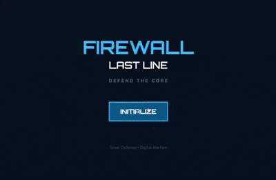

# 🛡️ Firewall: Last Line

> Um tower defense 2D com temática de cibersegurança, desenvolvido com TypeScript e Phaser.

🎮 **[Jogar Firewall: Last Line](https://acllaras.github.io/firewall-last-line/)**



## 🎮 Sobre o projeto

**Firewall: Last Line** é um jogo 2D de estratégia no estilo *tower defense*, no qual o jogador precisa proteger o **Core** de um sistema digital contra ondas de entidades maliciosas.

Para impedir que as ameaças alcancem o Core, o jogador posiciona programas defensivos em uma grade e precisa administrar sua energia estrategicamente ao longo das ondas.

O projeto foi inspirado na dinâmica estratégica de jogos como *Plants vs. Zombies*, mas possui identidade própria baseada em **cibersegurança**. Os defensores representam mecanismos e conceitos de proteção digital, enquanto os inimigos fazem referência a diferentes tipos de malware.

---

## 🛠️ Tecnologias

- **TypeScript** — linguagem principal
- **Phaser** — engine utilizada para desenvolvimento do jogo
- **Vite** — ambiente de desenvolvimento e build
- **HTML5 / CSS3**
- **Git & GitHub** — versionamento
- **GitHub Actions** — automação do processo de deploy
- **GitHub Pages** — hospedagem da versão jogável

---

## 🕹️ Como jogar

1. Selecione um defensor nos cards no topo da tela.
2. Clique em uma célula da grade para posicioná-lo.
3. Administre sua energia para construir novas unidades.
4. Utilize o **Miner** para gerar energia passivamente.
5. Combine diferentes tipos de defensores de acordo com os inimigos de cada onda.
6. Impeça que Malware, Worms e Trojans alcancem o **Core**.

`P` ou `ESC` pausa a partida.

O jogo possui **7 ondas**. Para vencer, o jogador precisa sobreviver a todas elas mantendo o Core, que possui 3 pontos de vida, intacto.

---

## 🛡️ Defensores

| Unidade | Papel | Custo | HP | Dano | Cadência | Característica |
|---|---|---:|---:|---:|---:|---|
| **Pulse** | Ataque rápido | 75 | 100 | 25 | 1.2s | Bom custo-benefício em dano direto |
| **Firewall** | Tanque | 90 | 360 | — | — | Bloqueia inimigos na pista e não ataca |
| **Miner** | Suporte | 100 | 80 | — | — | Gera +10 de energia a cada 8s |
| **Cryo** | Controle | 100 | 100 | 16 | 1.5s | Aplica redução de velocidade de 50% por 3s |
| **Tesla** | Dano em área | 150 | 120 | 40 (+24 em área) | 2.2s | Ataque em área com raio de 90 |

Cada unidade possui uma função específica, incentivando o jogador a combinar **ataque, defesa, controle e economia**.

---

## 👾 Inimigos

| Inimigo | HP | Velocidade | Dano | Recompensa |
|---|---:|---:|---:|---:|
| **Malware** | 140 | 32 | 13 | +10 energia |
| **Worm** | 85 | 52 | 9 | +15 energia |
| **Trojan** | 380 | 18 | 25 | +20 energia |
| **Boss (onda final)** | 850 | 13 | 36 | +20 energia |

Os diferentes atributos dos inimigos exigem que o jogador adapte sua estratégia durante a partida.

---

## ⚡ Sistema de energia

A energia funciona como o principal recurso do jogo e precisa ser administrada estrategicamente.

- Energia inicial: **280**
- Bônus ao concluir uma onda: **+40 de energia**
- Recompensa por eliminar inimigos: varia conforme o tipo
- Renda passiva: gerada pelo **Miner**

Investir em Miners no início pode aumentar a capacidade de defesa nas ondas posteriores, criando uma escolha entre **economia imediata e poder ofensivo**.

---

## 📁 Estrutura do projeto

```text
src/
├── entities/       # Defensores, inimigos e projéteis
├── scenes/         # MenuScene e GameScene
├── systems/        # WaveManager e gerenciamento das ondas
├── theme.ts        # Fontes e paleta de cores
└── style.css

public/
└── assets/         # Sprites dos defensores e inimigos
```

---

## 💻 Executando localmente

### Pré-requisitos

É necessário ter **Node.js** e **npm** instalados.

Clone o repositório:

```bash
git clone https://github.com/acllaras/firewall-last-line.git
```

Entre na pasta do projeto:

```bash
cd firewall-last-line
```

Instale as dependências:

```bash
npm install
```

Inicie o servidor de desenvolvimento:

```bash
npm run dev
```

O Vite exibirá no terminal um endereço local, geralmente:

```text
http://localhost:5173
```

Abra esse endereço no navegador.

### Build de produção

Para gerar a versão de produção:

```bash
npm run build
```

Os arquivos finais serão gerados na pasta `dist/`.

---

## 🌐 Deploy

A versão de produção é publicada no **GitHub Pages** através de um workflow automatizado com **GitHub Actions**.

🎮 **[Acesse a versão jogável](https://acllaras.github.io/firewall-last-line/)**

Novas alterações enviadas para a branch principal passam pelo processo de build e deploy configurado no projeto.

---

## 🚧 Status do projeto

**Versão jogável disponível.**

O projeto atualmente conta com:

- 5 tipos de defensores
- Diferentes funções de ataque, suporte, defesa e controle
- 3 tipos principais de inimigos
- Boss na onda final
- 7 ondas progressivas
- Sistema de energia
- Sistema de pausa
- Condições de vitória e derrota
- Interface temática inspirada em sistemas de cibersegurança
- Deploy automatizado

### Possíveis melhorias futuras

- Efeitos sonoros
- Trilha sonora
- Novos tipos de inimigos
- Novas unidades defensivas
- Novas fases e variações de dificuldade

---

## 👩‍💻 Autora

Desenvolvido por **Ana Clara Peixoto**.

Projeto desenvolvido como estudo prático de **TypeScript, desenvolvimento de jogos, lógica de programação e organização de projetos**.
